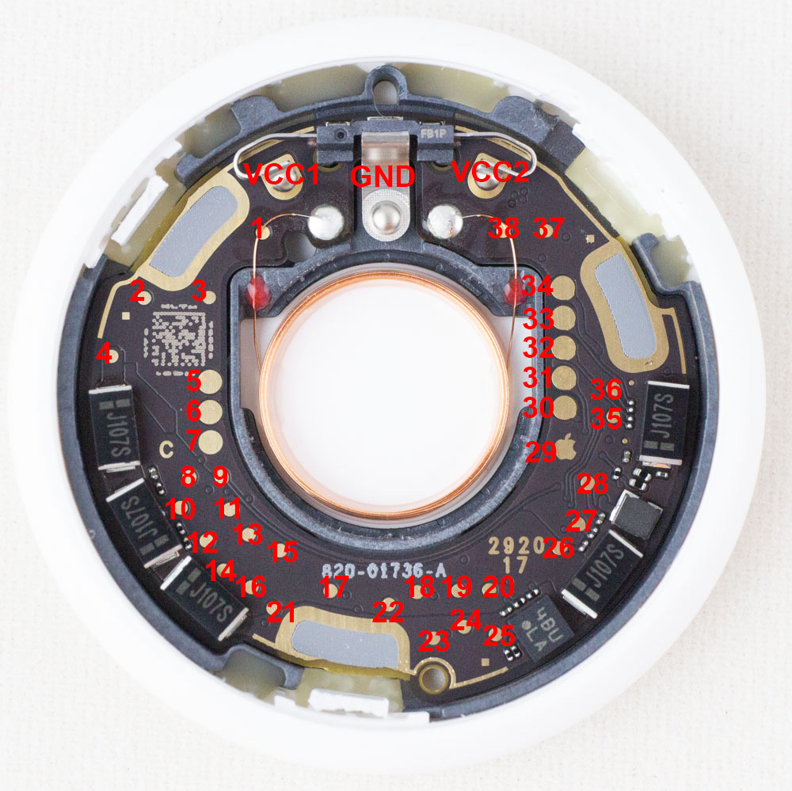
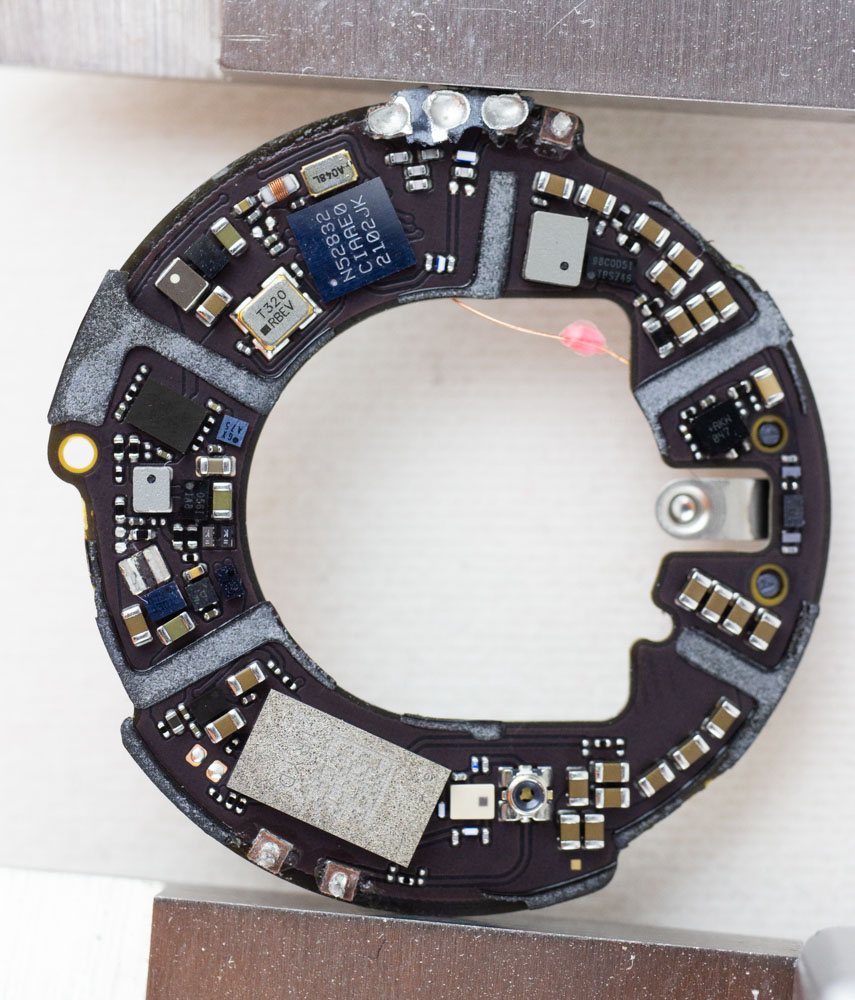
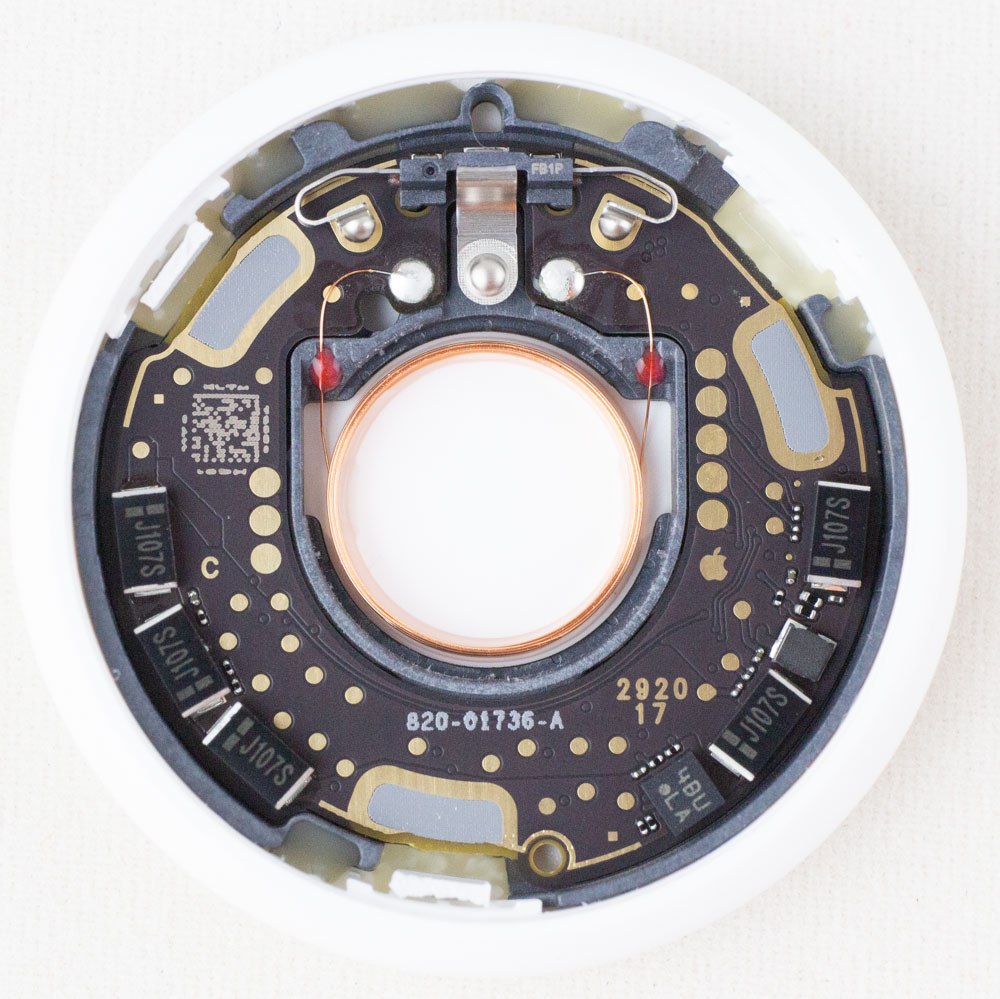

**NOTE 1: please fork this repo if using for your own use. I don't intend for this to be a central resource for airtag RE, more just some useful references for you to build on.**

**NOTE 2: This repo will not have any firmware or similar. Issues are disabled because the repo does not have any issues, it's perfect.**

## Test Points

|Name | Description                         |
|-----|-------------------------------------|
|VCC1 | +3.0V input (1 of 2 - both needed)* |
|VCC2 | +3.0V input (2 of 2 - both needed)* |
|GND  | Ground                              | 
|     |                                     |
| 22  | 1.8V SPI Flash - SCLK / nRF ball G3 (P0.17)              |
| 19  | 1.8V SPI Flash - Data In (COPI) / nRF ball H3 (P0.16)    |
| 20  | 1.8V SPI Flash - Data Out (CIPO) /nRF ball H4 (P0.15)    |
| 24  | 1.8V SPI Flash - Chip Select (CS)/ nRF ball F4 (P0.11)   |
| 21  | 1.8V SPI Flash VCC                  |
| 34  | 1.8V from nRF                       |
| 31  | nRF ball H2 (P0.18/SWO)             |
| 30  | nRF ball H1 (P0.21/nRST)            |
| 29  | Apple Logo :) GND                   |
| 36  | nRF ball G1 (SWDIO)                 |
| 35  | nRF ball F1 (SWCLK)                 |

*NOTE: The big pads under the VCC1/VCC2 battery terminals are NOT connected.
So if you remove the battery terminals you need to solder to the smaller pads where
the terminals connected!

### SPI Connections

The SPI connections (SCK/DI/DO/CS) are as above. If talking to the SPI flash chip note the following:

* You need to apply 1.8V on test point 21 to force the flash on.
* The nRF occasionally talks to SPI flash (especially when stuff like adding a device happens) which will interrupt this. But most of time the flash is powered off and thus the pins are tri-stated.

The nrf controls power to the SPI flash, so you need to override it by supplying 1.8V on test point 21.

## Images

See repo for higher resolution.

## License

This repo is licensed CC-BY-4.0.