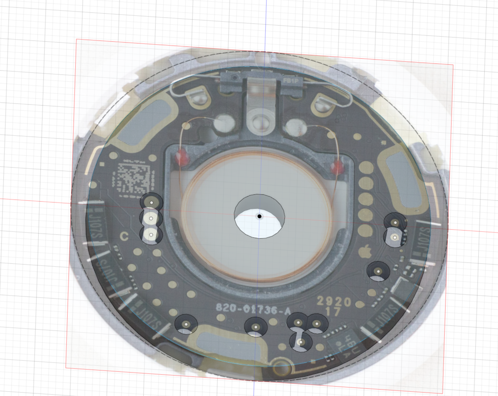
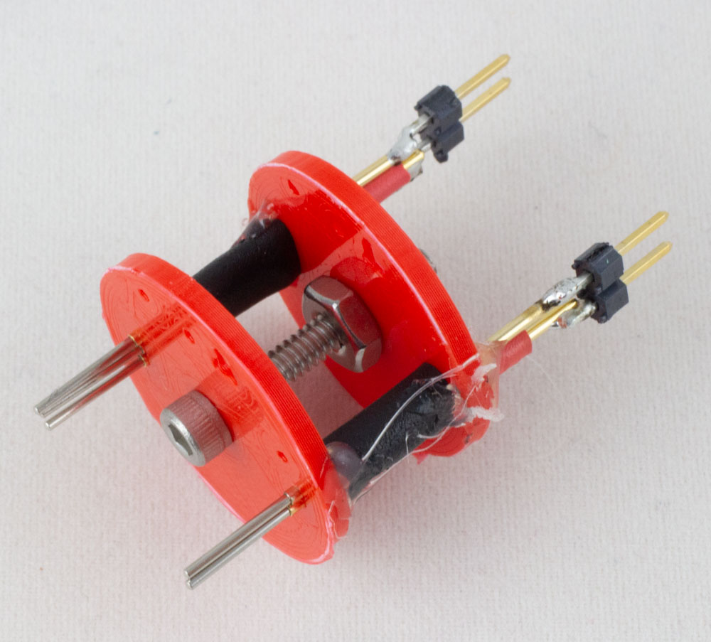
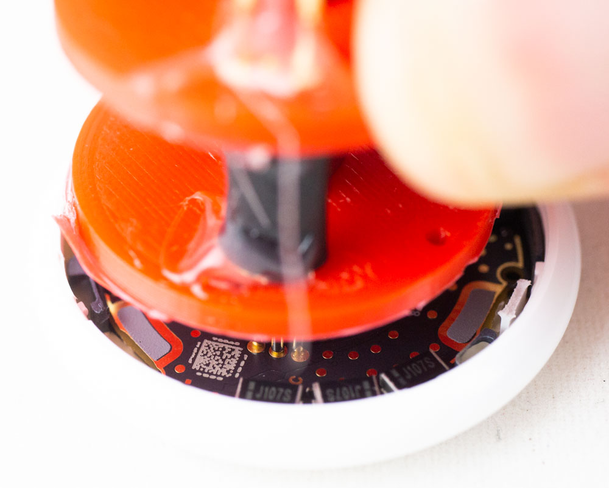

# Programming Jig / Test Point Adapter

You will need to customize the adapter for your pogo pins and test points you want. The easiest way to do this is via Fusion360 which should have an overlay of the image in the .f3d file:

If it requires the image, point it to `frontside-26mm-cropped.jpg` in the `images` directory.

The example here was printed for 1mm pins, but due to the 3D printer you'll need to adjust the hole size. The fusion360 history should allow you to easily adjust them all in one shot.

## Assembly

The jig is assembled using a 4-40 bolt as a spacer:

You'll need to add insulators for the pogo pins due to how closely they will fit. If you get smaller pins (these are 1mm diameter) you might be able to get away with just the 3D printed holes.

## Usage

Currently I was testing with hold it on - you'll want to 3D print a better system than that:

